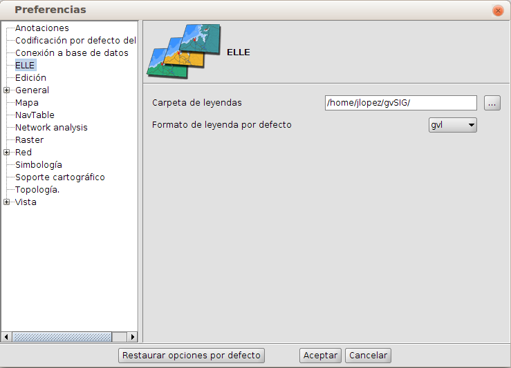
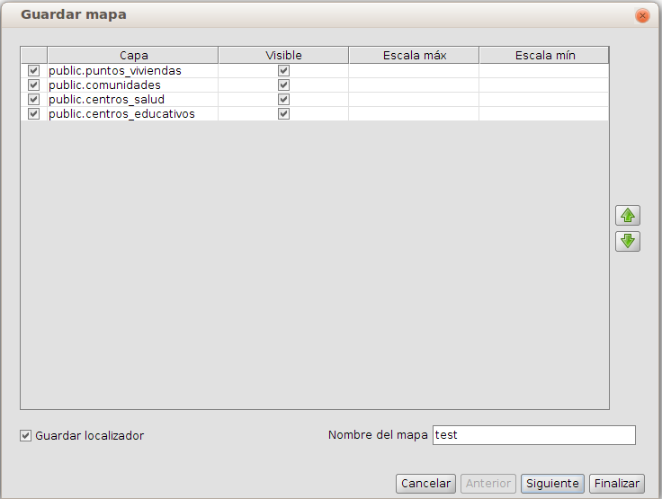
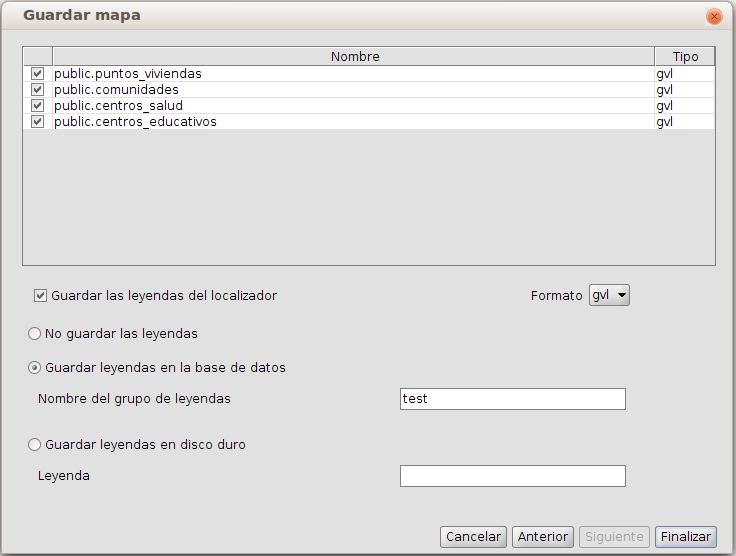
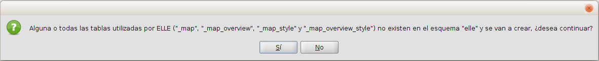
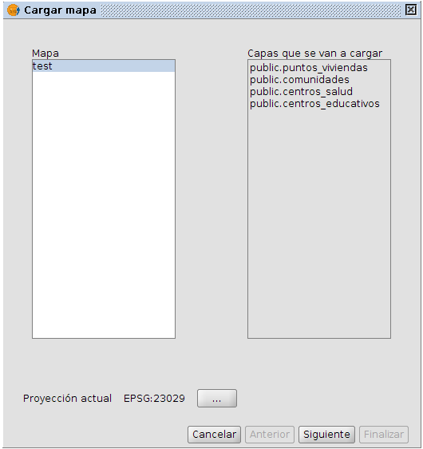
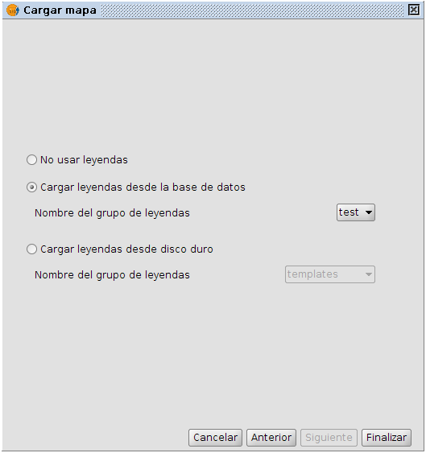
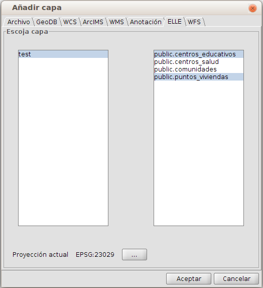
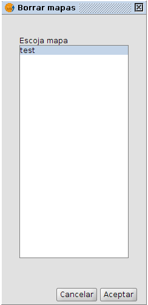
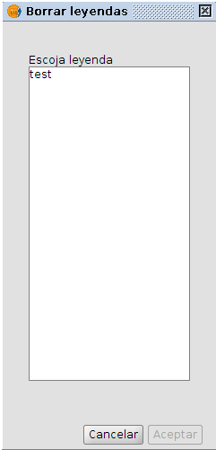

.. include:: <isonum.txt>

Manual básico de ELLE (Easy Layer Loader Extension)
****************************************************

Acerca de este manual
=====================

En el presente documento tiene como finalidad ofrecer información sobre la herramienta **ELLE**, acrónimo de **Easy Layer Loader Extension**, creada para facilitar en gvSIG la carga de conjuntos de capas entre distintos usuarios a través de una base de datos. En los apartados de este documento se describirán las propiedades de la herramienta, instrucciones de uso, características del proyecto NavTable y enlaces de interés.

Conviene aclarar que para hacer la aplicación más intuitiva ELLE denomina *mapas* a los conjuntos de capas, pero no debemos confundirlos con los mapas de gvSIG, representaciones de capas con leyenda y otros elementos gráficos pensadas para ser exportadas como imágenes. A lo largo de este documento el término *mapa* se usará para referirse a esos conjuntos de capas.

**Autores**:

- Jorge López Fernández

**Revisiones**

.. parsed-literal::

  Revisión 0.1: 18 de marzo de 2013

Copyright 2013 - Cartolab http://www.cartolab.es

El presente documento se distribuye bajo la licencia Creative Commons versión 3 con Reconocimiento y Compartir igual.

.. image:: images/by-sa.png
   :scale: 50%
   :align: center

Puede obtener más información sobre esta licencia en el siguiente enlace: http://creativecommons.org/licenses/by-sa/3.0/es/

Introducción
============

**ELLE** es una extensión de gvSIG que nos permite cargar y guardar **mapas** compuestos de capas almacenadas en una base de datos PostGIS dentro de la propia base de datos, incluyendo también la simbología definida.

Esta aplicación facilita la coordinación entre distintos usuarios que trabajan con las mismas capas evitando que tengan que compartir archivos de proyectos de gvSIG con la configuración de las vistas. También ha demostrado ser de gran utilidad en el momento de desplegar una instalación con un conjunto de datos al realizarse todo el proceso sólo en la base de datos.

**ELLE** se libera bajo una licencia GPL v3. Ha sido creado por el laboratorio **CartoLab** de la Universidade da Coruña y la empresa **iCarto**. Animamos a cualquier usuario a que nos haga llegar sugerencias, comentarios, informes de error, etc.

Listado de características
^^^^^^^^^^^^^^^^^^^^^^^^^^

1. Carga y guardado de mapas en base de datos.

2. Carga individual de capas de los mapas almacenados en base de datos.

3. Carga y guardado de simbología tanto en base de datos como disco duro.

Aspectos técnicos
^^^^^^^^^^^^^^^^^
ELLE fue desarrollado tomando como elemento central las interfaces para guardar, cargar y eliminar mapas y simbologías, ambas diseñadas con estructura de *wizard*, i.e. con diversas ventanas que nos indican las opciones paso a paso.

La conexión con la base de datos se realiza de manera transparente a través del plugin **extDBConnection**, lo cual nos permite que si dicho plugin se amplía a nuevos tipos de base de datos, ELLE los acepte de manera directa.

Recuerde que el código fuente de ELLE se encuentra a su disposición en la página del proyecto, al igual que el de extDBConnection en su propia página.

Requisitos
==========

ELLE es multiplataforma, por lo que puede ser instalado en entornos Windows, GNU/Linux y MacOS.

Es necesario tener previamente una instalación de gvSIG en su versión 1.x, que se puede descargar desde http://www.gvsig.gva.es, que a su vez debe tener la extensión extDBConnection, cuyo código está disponible en http://www.gitorious.org/extdbconnection

Más información sobre requisitos de gvSIG:

- Mínimos: Pentium III (o equivalente) / 256 MB RAM

- Recomendados: Pentium IV (o equivalente) / 512 MB RAM

Instalación
===========

Una vez instalado gvSIG versión 1.x en el ordenador junto con extDBConnection [#]_, se puede instalar ELLE descargando el fichero de binarios navTable_0.8.zip y descomprimiéndolo en la ruta siguiente:

.. [#] https://www.gitorious.org/extdbconnection

- Ejemplo en **Linux**:  /home/usuario/gvSIG_1.x/bin/gvSIG/extensiones/

- Ejemplo en **Mac**:  /home/usuario/gvSIG_1.x/bin/gvSIG/extensiones/

- Ejemplo en **Windows**: C:\Archivos de programa\gvSIG_1.x\bin\gvSIG\extensiones\

Preparación de la base de datos
^^^^^^^^^^^^^^^^^^^^^^^^^^^^^^^

Para que ELLE pueda guardar y cargar mapas en una base de datos Postgis simplemente deberemos crear en ella un esquema **elle**, en el cual el usuario que posteriormente vayamos a emplear para conectarnos deberá tener los permisos adecuados para la operación concreta [#]_.

.. [#] Si queremos que ELLE cree las tablas la primera vez, deberá ser administrador, para guardar nuevos datos deberá tener permisos de guardado y para cargarlos los deberá tener de lectura.

Instrucciones de uso
====================

.. |extDBConnection_button| image:: images/extDBConnection_button.png
   :scale: 50%

Para activar ELLE debemos en primer lugar conectarnos con extDBConnection a la base de datos, lo cual podemos hacer a través del menú en *Base de datos* |rarr| *Conectar a base de datos*, o con el botón |extDBConnection_button|, que nos abrirán la ventana de la `Figura 5.1`_ en la cual introduciremos los datos de conexión a la base de datos [#]_.

.. [#] En el diálogo se nos pide el esquema por defecto a conectarse, pero este dato no importa para ELLE, que siempre podrá detectar y acceder al suyo.
.. _Figura 5.1:

.. figure:: images/extDBConnection_dialog.png
   :scale: 40%
   
   Diálogo de conexión a la BD

Una vez que estemos conectados podremos acceder a las distintas funcionalidades:

Configuración de ELLE
^^^^^^^^^^^^^^^^^^^^^

ELLE añade una pestaña en las preferencias de gvSIG (ver figura `Figura 5.2`_) en la cual por ahora sólo se configura el directorio donde queremos guardar las leyendas cuando lo hacemos en disco duro y su formato. Podemos acceder a estas opciones a través de *Ventana* |rarr| *Preferencias* |rarr| *ELLE*.

.. _Figura 5.2:

   
   Preferencias de ELLE

Guardado de mapas
^^^^^^^^^^^^^^^^^

.. |ELLE_savemap_button| image:: images/ELLE_savemap_button.png
   :scale: 50%

Estando en una vista con las capas cargadas desde la base de datos que conforman el mapa que queremos guardar, podemos salvar su composición en la base de datos a la que estamos conectados accediendo a *Base de datos* |rarr| *Guardar mapa*, o con el botón |ELLE_savemap_button|, que nos abrirán el diálogo de la `Figura 5.3`_.

.. _Figura 5.3:

   
   Diálogo 1 de guardado de mapas

En esta ventana se nos listan las capas de la vista actual y podremos seleccionar las que queremos guardar y con qué características. Nos muestra una fila por cada capa, con los siguientes elementos de izquierda a derecha:

- Un checkbox que indica si la capa se incluirá en el mapa que guardaremos.
- El nombre de la capa (se guarda con el mismo nombre que tiene asignado en el TOC de la vista actual).
- La escala máxima a la que será visible cuando se cargue el mapa.
- La escala mínima a la que será visible cuando se cargue el mapa.

Las flechas a la derecha nos permiten cambiar el orden que tendrán las capas en el TOC cuando carguemos el mapa, y en la parte inferior le indicamos si queremos guardar también la configuración del localizador y un nombre para identificar el mapa. Si no estamos interesados en guardar las leyendas del mapa, podemos pulsar *Finalizar* para salvarlo, pero en caso de que las queramos conservar pulsaremos *Siguiente* para poder acceder al diálogo mostrado en la `Figura 5.4`_.

.. _Figura 5.4:

   
   Diálogo 2 de guardado de mapas

De nuevo se nos listan las capas de la vista actual y podremos seleccionar aquéllas de las cuales queremos guardar su simbología. En cada fila hay los siguientes elementos:

- Un checkbox que indica si se guardará la simbología de dicha capa.
- El nombre de la capa (se guarda con el mismo nombre que tiene asignado en el TOC de la vista actual).
- El formato en que se guardará la simbología.

Debajo podremos indicarle si queremos guardar la simbología del localizador y en qué formato, así como si toda la simbología la queremos guardar en base de datos o en el directorio de disco duro configurado en *Preferencias* (ver `Configuración de ELLE`), indicándole en ambos casos un nombre. Pulsaremos *Finalizar* para guardar todo.

En caso de que no existan todavía todas las tablas de ELLE, se nos presentará un diálogo de confirmación (ver `Figura 5.5`_).

.. _Figura 5.5:

   
   Diálogo de creación de tablas

Pulsando en *Sí*, y si el usuario con el que estamos conectados tiene los permisos de edición de base de datos, ELLE nos creará las tablas necesarias antes de guardar el mapa definido anteriormente.

Carga de mapas
^^^^^^^^^^^^^^

.. |ELLE_loadmap_button| image:: images/ELLE_loadmap_button.png
   :scale: 50%

En caso de que ya exista el esquema de ELLE en la base de datos, podremos cargar los mapas almcenados abriendo el diálogo correspondiente, a través del menú con *Base de datos* |rarr| *Cargar mapas*, o con el botón |ELLE_loadmap_button|. Se nos abrirá un diálogo como el mostrado en la figura `Figura 5.6`_.

.. _Figura 5.6:

   
   Diálogo 1 de carga de mapas

En este diálogo seleccionaremos en la columna de la izquierda el mapa que queremos cargar, mostrándosenos en la columna derecha las capas que lo componen. Debajo podremos seleccionar la proyección en caso de que la que está configurada por defecto no sea la correcta. Pulsando en *Siguiente* podremos configurar las leyendas a cargar (ver `Figura 5.7`_).

.. _Figura 5.7:

   
   Diálogo 2 de carga de mapas

Aquí podemos seleccionar entre no cargar ninguna leyenda, cargarla desde base de datos o cargarla desde el directorio configurado en disco duro (en estos dos casos, si hay una leyenda con el mismo nombre que el mapa, se seleccionará por defecto). Pulsando en *Finalizar* se nos añadirán las capas a la vista actual, o en caso de que no tuviéramos una vista abierta, se nos creará una nueva con dichas capas cargadas.

Carga de capas individuales
^^^^^^^^^^^^^^^^^^^^^^^^^^^

.. |loadlayer_button| image:: images/loadlayer_button.png
   :scale: 50%
   
ELLE también nos da la opción de cargar individualmente las capas que componen los mapas. Para ello accedemos a la interfaz de carga de capas de gvSIG a través de *Vista* |rarr| *Añadir capas*, o con el botón |loadlayer_button|. Una vez abierto el diálogo pinchamos en la pestaña *ELLE*, y ahí se nos muestra una interfaz como la de la `Figura 5.8`_.

.. _Figura 5.8:

   
   Diálogo de carga de capas individuales
   
En la columna de la izquierda seleccionaremos el mapa deseado, en la de la derecha la(s) capa(s) [#]_ que deseamos cargar en la vista actual y pulsaremos *Aceptar*.

.. [#] La selección múltiple se puede realizar manteniendo pulsada la tecla *Ctrl* para selecciones individuales o con *Mayús* para escoger intervalos.

Borrado de mapas
^^^^^^^^^^^^^^^^

Los mapas guardados en la base de datos se pueden eliminar accediendo a *Base de datos* |rarr| *Borrar mapas*, mostrando una interfaz como en la `Figura 5.9`_.

.. _Figura 5.9:

   
   Diálogo de borrado de mapas

Seleccionamos del listado el mapa que queremos eliminar, pulsamos *Aceptar* y confirmamos su borrado.

Guardado independiente de leyendas
^^^^^^^^^^^^^^^^^^^^^^^^^^^^^^^^^^

La simbología de las capas de la vista actual se puede guardar a través del menú pulsando en *Base de datos* |rarr| *Guardar leyendas* y luego el conjunto de capas que queramos:

- *Capas activas*
- *Capas visibles*
- *Capas del localizador*
- *Todas las capas*

Esta última opción también es accesible a través del botón |savelegend_button|. Cada uno de estos comandos seleccionará un conjunto de capas y opciones por defecto, pero todos abrirán una ventana análoga y con las mismas funcionalidades que el segundo diálogo de guardado (`Figura 5.4`_) visto en la sección `Guardado de mapas`_.

Carga independiente de leyendas
^^^^^^^^^^^^^^^^^^^^^^^^^^^^^^^

.. |loadlegend_button| image:: images/ELLE_loadlegend_button.png
   :scale: 50%

Podemos cargar una simbología distinta para las capas de la vista actual a través del menú con *Base de datos* |rarr| *Cargar leyendas*, o con el botón |loadlegend_button|. Esto nos abrirá un diálogo análogo y con las mismas funcionalidades que el segundo diálogo de carga (`Figura 5.7`_) visto en la sección `Carga de mapas`_. Una vez que confirmemos, se aplicarán las simbologías de aquellas capas definidas al guardar la leyenda que coincidan con las que existen en el TOC en dicho momento.

Borrado de leyendas
^^^^^^^^^^^^^^^^^^^

Las leyendas guardadas en la base de datos se pueden eliminar accediendo a *Base de datos* |rarr| *Borrar leyendas*, que abrirá una ventana con la misma estructura que en la `Figura 5.10`_.

.. _Figura 5.10:

   
   Diálogo de borrado de leyendas

Seleccionamos del listado la leyenda que queremos eliminar, pulsamos *Aceptar* y confirmamos su borrado.

Más información sobre ELLE
==========================

ELLE está alojado en un repositorio de **gitorious** [#]_. En esta página se puede encontrar información sobre el proyecto, además de poder acceder al repositorio para consultar su código fuente o descargarlo.

.. [#] https://gitorious.org/elle

En el portal *YouTube* existe un vídeo tutorial sobre el uso de ELLE: http://youtu.be/I8vX9nuC1Wk

Colaboración
============

ELLE se encuentra en proceso de desarrollo continuo, incorporando mejoras, corrigiendo fallos, etc. Por ello, todas las sugerencias, ideas, comentarios, críticas, notificación de errores serán bien recibidas.

Puedes colaborar en ELLE aportando ideas, comentarios, informando de errores, traduciendo a otro idioma, etc. Las vías para esto son las siguientes:

- **Correo electrónico:** cartolab@udc.es

- **Listas de correo del proyecto gvSIG:** http://www.gvsig.org/web/home/community/mailing-lists

¡Ayúdanos a construir una herramienta todavía más útil!

Créditos
========

.. image:: images/logo_cartolab.png
   :scale: 20%

CartoLab - Universidade da Coruña 
http://www.cartolab.es/

**Director:** Fco. Alberto Varela García.

**Equipo de desarrollo actual:**

- Francisco Puga Alonso

- Jorge López Fernández

**Miembros anteriores:**

- Juan Ignacio Varela García

- Javier Estévez Valiñas

|

.. image:: images/logo_icarto.png
   :scale: 50%

iCarto
http://www.icarto.es/

**Equipo de desarrollo actual:**

- Andrés Maneiro Boga

- Pablo Sanxiao Roca

Han aportado ideas, comentarios, sugerencias y/o informado de errores:

- Francisco Alberto Varela García [C]

- Daniel Díaz Grandío [C]

- Adrián Eirís Torres [C]

- Vanessa Ros Candeira [C-a]

- Concepción Alonso Rodríguez [C-a]

- Javier Lendoiro Santos [C-a]

- Francisco Fernández Leal [C-a]

- Enar Chouse Devesa [C-a]

- Gonzalo Martinez Crespo [iC]

- Jorge Ocampo Couto [iC]

- Antón Amado Pousa [iC]

- Carmen Molejón Quintana [iC-a]

- José María Jiménez Bernal [aut]

.. parsed-literal::

  [C]: CartoLab
  [C-a]: CartoLab (antiguos miembros)
  [iC]: iCarto
  [iC-a]: iCarto (antiguos miembros)
  [aut]: autónomo

Licencia: GPLv3. Puede ver los términos de esta licencia en http://www.gnu.org/licenses
